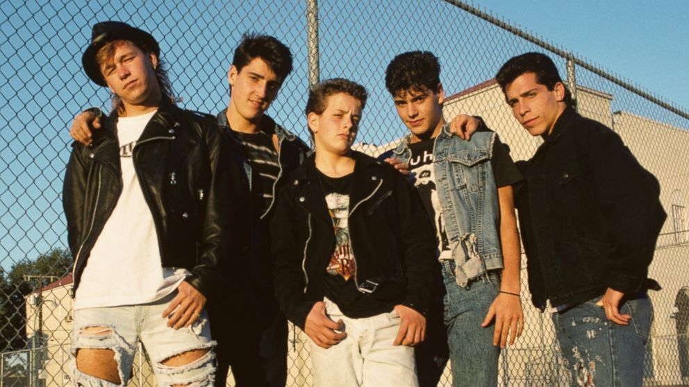
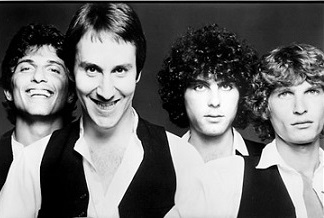

<!--StartFragment-->

Listening to the billboard for 1988 I stopped in my tracks when I heard “Shake your Love” by Debbie Gibson. I knew the song but couldn’t place where it was from. A few days later I had an epiphany that I didn’t know the song itself but rather a critique of the song from Bill Hicks. Bill Hicks is a stand up comedian, and was an early hero of mine. He helped me see the world in a completely different light and I will always appreciate him for that. I am now going to overanalyze his bit because I think he has a flawed view of music culture, and he echoes a sentiment I see as people age. 

Bill Hicks late 80s stand up focused a lot on music and the banality of pop music. He suggested that songs like “Shake your Love” were bad for the youth and bad for culture because they promoted a vision of bland consumerism when compared to the heroes of the late 60s who rocked out and cried for revolution. Just listen to him yelling about passionless New Kids on the Block. Fair warning, Hicks and contemporaries like Sam Kinnison yelled a lot when doing stand up. (note this is not the only version of this bit and anyone familiar with Hicks would know this is a topic he frequently revisits)

<https://www.youtube.com/watch?v=IiqznC2ROfI>

<iframe width="1180" height="664" src="https://www.youtube.com/embed/IiqznC2ROfI" frameborder="0" allow="accelerometer; autoplay; clipboard-write; encrypted-media; gyroscope; picture-in-picture" allowfullscreen></iframe>

TLDW: Hicks shouts as much as he jokes about the lack of passion in popular music, and it’s promotion of a shallow, consumer culture. He wants his musicians to play from their heart, shouting loudly as he enshrines 60s artists with the passion he believes we’ve lost.  

Bill Hick’s bit on the new music of the late 80s was a success because there are people in the audience that share his sentiment. It’s one that I have heard about every decade since the 1960s, and the only reason I don’t hear it about the 60s is I don’t know anyone old enough who wants to complain about that decade although I am sure they exist. I love Bill, but I think he falls into a trap that many people who get old and complain about “new music”. The first mistake is misremembering the music scene when they came of age, and the second is a lack of awareness of what “cool” kids were actually listening to in the late 80s. 

**The Kids Aren’t Alright:  Banality of Pop and Music for young Teens**

First let’s take New Kids on the Block, who had their top charting song “I’ll be Loving you Forever” which is about as cheesy as a ballad can get. It’s coupled with a cringe inducing music video. It’s a version of Boy Bands that takes almost an evolved form of 1950s do-op specifically catered to young teenagers.

First off, this music is marketed and created with 13 year olds in mind. It is the late 80s version of Justin Bieber. Bill complains about hearing it on the radio, which shows the flaws in radio as a medium more than the artist itself. It wasn’t ever going to appeal to someone in their mid-30s. Bill, however, has a problem with it being the thing the youth listen to. This is where I think people tend to misremember their youth. The music they identified with, they talk about as if that was what was culturally relevant when it was likely relevant for people like Bill and his friends. While Velvet Underground are remembered as great artists of their day, a non music fan would have never been exposed to their music at their artistic height, even accidentally. 

Bill was born in 1961 and would have been 15 in 1976. In 1976 the number one billboard song was “Silly Love Songs” by Wings. The irony here is outrageous. The message of the song is literally: what is wrong with silly love songs and almost plays as a direct defense of “I’ll be Loving you Forever” by New Kids on the Block. I love Paul McCartney but I will be honest this song is almost as cheesy as New Kids on the Block, and to be fair to Paul that is the point. The irony is extra delicious as he points to The Beatles as the shining example of good music for teens in the stand up bit above. 

In 1979 Bill would have been 18. The number one song on Billboard top 100 was “My Sharona” by the Knack. While not as cheesy as the New Kids, you can look at the two bands side by side and see clearly attractive people capitalizing on the trends of the day with cheesy love songs (New Wave was the trend of the late 70s and the two guys on the right look like a more attractive version of Hall and Oates). “My Sharona” is slightly more riskay, but barely. It’s sexual but less so than George Michael who dominated the charts in 1988. Either way it's hardly the passionate music of Jimi Hendrix that Bill enshrines as the epitome of music. It’s cheesy, poppy, and light. 

New Kids on the Block vs. The Knack:

Lastly, let’s look back to the time that Hicks is memorializing: the late 60s. The number one song in 1967, the summer of love, was from a movie “To Sir with Love”. While considerably less cheesy than the late 70s and late 80s, it is nonetheless a silly love song as Paul McCartney would say. So while visions of Haight Ashbury and the great music of 1967 are etched in our collective memory of that time, if you were in any given place during that year the song you were most likely to hear on the radio was a straightforward, light-hearted, love song. 

Blackfish in Game of Thrones says: “It often comforts me to think that even in war’s darkest days, in most places in the world absolutely nothing is happening.” I think a similar phenomenon exists in music. Despite whatever you were listening to while you were in your formative years that felt like the most important thing happening in the world, most of America was listening to cheesy love songs.

The reason the most banal straight forward music rides to the top is that it’s easily digestible, contains simple and universal themes, and is as inoffensive as possible to ensure the widest reach possible. On the other hand, music that one might form an identity around is more likely to take a stand on something or promote a way of seeing the world that is outside of the norm. It should come to no one's surprise that this music is less popular. There are times when counter culture blends with mainstream culture such as hippies charting in the 60s, grunge in the 90s, gangster rap in the 90s, but this is unusual, and never truly dethrones banal music that dominates the billboard year end chart in any given year. The counter culture ultimately gives way to never a never ending parade of easy to digest and cheesy love songs. 

**Play from your Fucking Heart**

Meanwhile in 1988, artists that stand the test of time most definitely played from their fucking heart. Arguably the most anti-authoritarian song to ever gain mainstream success is released in “Fuck the Police”. You want to talk about passion? N.W.A probably put their lives in danger releasing that song, and the delivery is nothing if not passionate. Their attitude embodies nearly everything Bill Hicks stands for. 

In a similar vein, Public Enemy also played from their fucking heart. Listening to “Bring the Noise”, and you can feel the same energy that inspired Dylan, Hendrix, or Lennon to write some of the most passionate music ever released. 

Hip hop doesn’t have a monopoly on passion in 1988. Take Sonic Youth’s noise approach where Thurston Moore’s guitar resembles the devil shouting Hicks clamors for. On “The Sprawl” Kim Gordon echoes Bill Hicks with a sinister mockery of consumer culture. 

One last example from 1988 would be the Pixies “Bone Machine”. Not only is the band a symbol of alternative culture of that time, but the passion of their performance on this song is not subtle. I wouldn’t be surprised if they had popped a blood vessel when they recorded the track. All of this music was released basically at the same time that Hicks would have said this bit on his own tour.

**We Remember Good Music and Forget the Bland**

All this said, I don’t blame Hicks for missing this music in 1988. Most people did. I don’t blame him for raging against soulless pop music that seems to get everyone excited for something that so painfully lacks meaning. I have felt that same way. I now think this worldview is fundamentally flawed and baked in a false nostalgia. It’s almost as if every generation has its own rage against the mainstream. In the late 90s people bemoaned the rise of bubblegum pop, while simultaneously Radiohead’s OK Computer emerged commercially successful and diametrically opposed to everything modern culture stood for. Every era of music has this phenomenon. Perhaps a banal mainstream culture is necessary to incentivize people to have a more unique vision. Perhaps there will always be a group of people doomed to believe that maybe a collective epiphany will occur to form a more conscientious world. 

I think Bill Hicks would be pleasantly surprised in how music from 1988 is remembered. Check any list from a music publication and Debbie Gibson or New Kids on the Block will be nonexistent while Sonic Youth and Public Enemy will be discussed as the great artists of that time. It’s not just the press, there is a genuine disparity in popularity. At the time of writing this article I’ll Be Loving You Forever has just under 30 million streams on Spotify meanwhile Teenage Riot by Sonic Youth (released the same year) has around 40 million. That’s coming from a band that had to work second jobs while recording Daydream Nation. Meanwhile “Shake Your Love” has a measly 3 million streams and “Straight Outta Compton” (the song) has nearly 200 million. 

The same phenomenon can be said for “To Sir With Love” which has less than 15 million streams, meanwhile “Sunday Morning” by The Velvet Underground who were virtual nobody's at the time has 66 million streams. This is not a perfect measure of current cultural relevance, but it’s a very good proxy. 

<!--EndFragment-->